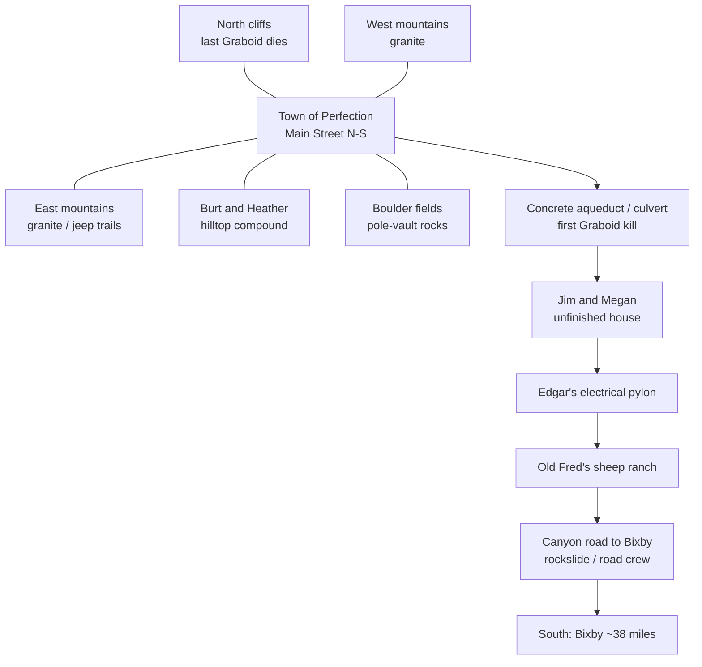

# Perfection and Perfection Valley — film geography

Research notes for the prototype map. **Primary source is Tremors (1990).** Later films and the TV series rebuilt the town on other lots; they are marked when used. Production facts come from Stampede Entertainment (S. S. Wilson / Brent Maddock FAQ) and production designer Ivo Cristante.

This is **not** a claim that the current node map matches the film. Several prototype nodes are composites or inventions. See [Prototype vs film](#prototype-vs-film) at the end.

## Valley shape (the box canyon)

Perfection Valley is a north–south box canyon in fictional Nevada, nearest the also-fictional town of **Bixby** (~30–38 miles south). Stampede’s official orientation:

- **North:** cliffs. This is the wall Val stampedes the last Graboid through / over.
- **East and west:** granite mountains. Graboids cannot leave that way.
- **South:** the only paved road, winding and narrowing toward Bixby. A granite ridge at that end also hems Graboids in.

The wall map Val rips off Chang’s (“this valley is just one long smorgasbord”) is a retouched 1987 AAA map of Cedar Grove / Kings Canyon, hung to show the long valley easily. Wilson’s reading: Perfection sits at the **south** (right-hand) end of that display, which would put Chang’s on the **east** side of Main Street in movie-reality. The **physical set** was built the other way: Main Street ran north–south, Chang’s on the **west**, Nestor’s trailer toward the north.

Stampede later admitted a continuity snag: every early T-1 victim is **south** of town (between Perfection and Bixby). Burt’s T-3 line that they “moved down from the north, just like last time” is wrong. Fan-compatible fix they endorsed: the 1989 batch hatched south of town, hit the southern granite ridge, then ate their way **north** into Perfection.

Rhonda has seismographs **all over the valley**, which is why she can appear both near the first full Graboid reveal and later at the concrete ditch.

---

## The town of Perfection (1990)

Population sign: **14**. Stampede’s joke-and-patch: Edgar and Old Fred lived far enough out that they may not be on the sign; Melvin’s parents are “in Vegas gambling.”

Ivo Cristante built the set in two months on open desert **east of Olancha, California** (Cactus Flat Road area), with Alabama Hills / Lone Pine used for valley and mountain backgrounds. The set had a **market, one paved street, telephone poles, a garbage dump, a horse corral, houses and mobile homes**. It was torn down after the 1989 shoot. Chang’s interior and Burt’s basement were soundstages in Valencia.

There is **no school, no separate bar, no town clinic**. Chang’s is store, tavern, and command post. The doctor lives in a half-finished house **out of town**.

### Main Street (set reality)

North is toward Nestor. Chang’s is on the west sidewalk.

| Place | What it is | Major movie events |
| --- | --- | --- |
| **Walter Chang’s Market** | Only real commercial building. 60 ft front × 30 ft deep; 12 ft ceiling so Rhonda can climb the shelves; 2 ft roof parapet (taller stepped front, ~16.5 ft, where Val sets the radio). Faded paint under the sign reads **“Company”** — Cristante’s mining-town history. | Hub of the siege. Walter names the creatures **Graboids**. Val’s valley map. Radio call to Burt. Graboid comes through the floor and kills Walter while he goes for a gun. Survivors onto the roof. Val later jumps off this roof toward the Cat; the awning collapse was unplanned and kept. |
| **Water tower** | Tallest structure; wiki and production stills put it **next to Chang’s**. | Establishing shots and rooftop geography. Not a death site in T-1. |
| **Nancy Sterngood’s house** | The only proper occupied house on the street. Pottery / hippie household. A dilapidated empty house sits behind it. | Mindy on the roof during the night siege; a Graboid tries for her; she jumps and is pulled to safety. Nancy stays with the group after. |
| **Nestor Cunningham’s trailer** | North of Chang’s, **same side of the street**, corrugated-metal fence, spare tire in the yard. ~30 ft Elcar-style trailer. | Nestor leaves the rooftops, sure that if he stays still they cannot find him. He stands in the inner tube. The Graboid pulls him through the floor. |
| **Melvin Plugg’s mobile home** | Across the street from Chang’s, astroturf porch, beside a rusted **Quonset**. Melvin has a **play shack** between Chang’s and Nestor’s. Parents absent (Vegas). | Melvin’s fake-Graboid prank (Burt almost shoots him). Night siege on the roof. Survives. |
| **Val’s travel trailer** | Small trailer. Exact lot is debated in fan reconstructions (not across from Chang’s; likely south of the water tower with Earl’s). | Opening domestic scenes; they decide to skip town for Bixby. |
| **Earl’s travel trailer** | Separate small trailer near Val’s. | Same. They also keep a septic-pump trailer for odd jobs. |
| **Walter’s trailer?** | Fan inference: a larger trailer with a green awning past the water tower. Never confirmed on screen as his home. He dies at the store. | — |
| **Junkyard / dump** | End of the street: rust, fence, abandoned machines. | Home of the **Caterpillar track loader** and the earth-mover trailer they hitch for the mountain run. |
| **Horse corral** | On the set list; horses are how Val and Earl try for Bixby after the truck is unsafe. | They ride out; the first full Graboid spooks the horses; chase to the aqueduct. |
| **Quonset hut** | Rusted, apparently unused, next to Melvin. | Background / junk, not a set-piece scene. |

Chang’s also functions as the **post office** (Burt’s mail would land here; Bixby is too far for a PO box). Original script piled extra jobs onto the store (video rental, etc.).

---

## Outlying buildings (still “Perfection,” not downtown)

These are the places the Graboids eat **before** the rooftop siege. Stampede: they sit on the **Bixby road**, south of town.

| Place | What it is | Major movie events |
| --- | --- | --- |
| **Edgar Deems’ electrical pylon** | Power pole / electrical tower in open desert. Edgar is a hermit (donkey Justine). **Not a radio tower.** | First body. He climbed with a Winchester and stayed until he died of **dehydration** (Jim: three or four days). Too scared to come down. Val and Earl find him on the way out of town. |
| **Old Fred’s sheep ranch** | Garden, scarecrow, sheep pens. Cristante thought the crop was probably corn. No last name in the script. | Eaten while hoeing; flock slaughtered. Val and Earl find the head in the sand and assume a murderer. His truck “disappearing” is a known continuity slip. |
| **Canyon road / road crew** | The only paved way to Bixby. Howard and Carmine repairing asphalt. | Val/Earl warn them; ignored. Carmine’s jackhammer hits a Graboid (orange blood). The other is killed in the **rockslide** that seals the valley. Phone lines die around the same stretch (FAQ body count also includes two telephone repairmen). |
| **Jim and Megan Wallace’s place** | Half-finished house, small mobile home, station wagon, lumber and cinder block. They are building, not running a town clinic. Jim is the doctor. | They examine Edgar and plan to call the Bixby coroner. Later they try to leave; Val and Earl find the **station wagon buried** beside the camper. Both dead (Megan possibly crushed/buried). |
| **Miguel Sanchez** | Cattle man. Mentions missing stock. In T-1 he is **in town** for the siege, not killed on a ranch. The separate cattle ranch is later-franchise (Rosalita / T-3). | Survives T-1. Dies in T-3 (Ass Blaster). |
| **Burt and Heather Gummer’s compound** | Hilltop house a few miles out, **not** on Main Street. From Chang’s roof the camera cheats: they appear to look east. Basement armory (Valencia interior). Concrete / prepper build. | Radio from the rooftop. A Graboid breaches the basement. They empty the gun wall and kill it — first deliberate kill, second Graboid dead after the aqueduct. Later the group comes here for pipe bombs. T-3: house destroyed, replaced by a bunker. |

---

## Valley landmarks (Phase 2 geography)

These are the “islands” the movie is built around. Wilson’s origin note: stranded on a Mojave boulder while something moved underneath.

| Place | What it is | Major movie events |
| --- | --- | --- |
| **Concrete aqueduct / culvert** | Hard-walled irrigation ditch. | First time the full Graboid is seen. It chases Val and Earl off the horses and **rams the concrete**, killing itself. Rhonda walks up on the aftermath and reads **three more** on her seismographs. Prototype node `aqueduct` is this scene. |
| **Pole-vault boulder field** | Cluster of rocks. Most were **fake** (chicken-wire / stucco) so the gaps matched the stunt. | Overnight trap: Val, Earl, Rhonda realize the worms hunt **vibration**. They find discarded poles and vault rock-to-rock to Rhonda’s truck. This is the film’s premise made literal. |
| **Rhonda’s truck / seismograph stations** | Truck plus geophones scattered valley-wide. | Escape vehicle after the vault. Later unused as a jeep-trail taxi (FAQ: that would end the movie). |
| **Open desert between town and mountains** | Soft ground. | Survivors try the **Cat + trailer**. Graboids **cooperate** and dig a pit trap; the loader drops in. Stuntwoman sprained an ankle jumping into the bucket. |
| **Second boulder refuge** | After the Cat dies. | Earl’s plan: homemade **pipe bombs**. One Graboid swallows and dies. The last **spits a bomb back** and wrecks the stockpile. |
| **North cliffs / climax wall** | End of the box canyon. Fake rock face built for the Sierra Nevada backdrop. | Val uses the last bomb as a noisemaker and **stampedes** the last Graboid over/through the cliff. It cannot stop because it is in pain (Wilson: echolocation normally would have “seen” the drop). |
| **Mountain jeep trails** | Barely passable paths in the east/west granite. | Discussed, never used. Graboids cannot follow onto rock. |
| **“Radio tower”** | **Not in T-1 as a manned landmark.** Edgar’s death is an **electrical pylon**. A radio appears as the rooftop set and as Burt’s comms. | Prototype `radio` node is a composite of Edgar’s pole + “get the radio working.” |

---

## Story order (how the geography is used)

1. Town Main Street — Val and Earl pack for Bixby.
2. **Edgar’s pylon** (south) — first proof something is wrong.
3. **Jim and Megan’s yard** — dehydration ruling.
4. **Old Fred’s ranch** (south) — first massacre.
5. **Canyon road** — road crew die; **rockslide** closes the valley.
6. Back to **Chang’s** — phones dead; tentacle on the truck axle.
7. Horses south again — **Wallace wagon** buried; first full Graboid; **aqueduct** kill; **Rhonda**; **pole-vault rocks**.
8. **Chang’s siege** — Walter named and killed; rooftops; **Burt’s basement** kill (radio); **Nestor’s trailer**; **Mindy / Nancy’s roof**.
9. **Junkyard Cat** — pit trap in open ground.
10. **Boulders + Burt’s bombs** — third Graboid dead.
11. **North cliffs** — last Graboid.
12. Return to town; they finally reach the outside world.

---

## Board mapping

The board was corrected against this research **without changing the graph**: every node id, route, sector, and stat is unchanged from the simulated build, so the ~44% turtle win rate still applies. Only names, notes, and card text moved. Two deliberate compressions remain and are listed after the table.

| Node id | Board name | Film location | Key scene |
| --- | --- | --- | --- |
| `store` | Chang’s Market | Chang’s Market (store, tavern, post office) | Siege hub; Walter names the Graboids and dies through the floor |
| `bar` | Melvin’s Place | Melvin’s mobile home + Quonset, across the street | Fake-Graboid prank; rooftop night |
| `clinic` | Jim & Megan’s | The doctor’s half-built house | Edgar’s autopsy; buried station wagon |
| `school` | Horse Corral | The set’s horse corral | Val and Earl borrow the horses; barbed wire |
| `nancy` | Nancy’s House | Nancy and Mindy’s house | Mindy on the roof |
| `trailer` | Nestor’s Trailer | Nestor’s fenced trailer | Pulled through the floor standing in a spare tire |
| `rhonda` | Rhonda’s Camp | Her seismograph stations (mobile) | The readings that predict the worms |
| `burt` | Burt & Heather’s | Hilltop compound | Basement breach; the gun-wall kill; bomb factory |
| `ranch` | Old Fred’s Ranch | Old Fred’s garden and sheep pens | First massacre; the severed head |
| `edgar` | Edgar’s Pylon | The electrical tower | First body; dehydration |
| `radio` | Telephone Line | The phone poles toward Bixby | Phones die; the town is cut off |
| `water` | Water Tower | The water tower | Tallest structure in town |
| `fuel` | Gas Pumps | Pumps and tin sheds | Fuel for the Cat |
| `workshop` | Garbage Dump | The set’s garbage dump | Salvage; ringing metal |
| `caterpillar` | Junkyard (Caterpillar) | Junkyard where the Cat sits | The loader escape; pit trap |
| `aqueduct` | Concrete Aqueduct | The culvert | First full Graboid dies against the wall |
| `highway` | Bixby Road | The one paved road south | Road crew; rockslide seals the valley |
| `mountain_road` | North Cliffs | The northern rim and jeep trails | The last Graboid stampedes over the edge |

Known compressions (accepted to preserve the simulated graph):

- **Compass folding.** The film puts Edgar, Old Fred, and Jim & Megan **south** on the Bixby road; the board rings them around town (A and B sectors). The victim trail is preserved as places, not bearings.
- **Adjacency licence.** The water tower stands beside Chang’s in the film but lives in sector C; Nestor is north of Chang’s in the film but lives in sector D. Moving either would change sector noise pools and hunt behaviour, which the simulations were calibrated on.
- The `radio` node keeps its tower type (climbable, ungrabbable) — the film equivalent of being treed on a pole is Edgar’s fate.

Phase 2 of the design conversation (fold-out valley: dirt vs rock vs road vs vehicle noise) is the pole-vault rocks, Cat run, Burt’s hill, aqueduct, and north cliffs. Those are the film’s actual second board.

## Sources

- Stampede Entertainment Tremors FAQ — valley orientation, Chang’s dimensions, set demolition, fake rocks, body count, south-to-north eating order, jeep-trail question. https://stampede-entertainment.com/site/fan-extras/tremors-faq/
- Wikipedia, *Tremors* (1990) — plot order, Olancha set list, Valencia interiors, Alabama Hills.
- Horror Film Wiki / Tremors Wiki — Edgar, Old Fred, Wallace house, aqueduct, pole vault, Cat pit.
- IMSDb *Tremors* script excerpts — Edgar → Fred garden → Wallace house (wallboard) geography in scene headers.
- The Miniatures Page, “Perfection, Nevada For 15mm” — street-side inventory from repeated film stills plus the same FAQ (Chang’s west, Nestor north, Melvin/Quonset, dump/Cat).
- GNDN, “Tremors: Map of Perfection Found!” — AAA 1987 Cedar Grove map under Val’s wall map.
- Ars Technica, Tremors 30th — population and siege summary.

Filming GPS circulating online (Olancha town site vs Alabama Hills rocks) is **production geography**, not in-universe Nevada. Do not treat those coordinates as Perfection’s map.